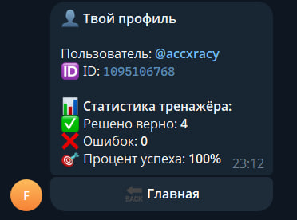

# Telegram-бот для подготовки по физике и математике

## Описание проекта
Проект представляет собой Telegram-бота, разработанного для помощи школьникам при подготовке по математике и физике. Бот объединяет в одном интерфейсе учебные материалы, тренировочные задачи, статистику пользователя и AI-помощник для объяснения решений и ответов на вопросы.

Основная идея проекта — сделать удобный инструмент для самостоятельной подготовки, где пользователь может не только читать теорию, но и сразу отрабатывать материал на практике.

---

## Цель проекта
Цель проекта — создать Telegram-бота, который:
- предоставляет структурированные материалы по математике и физике;
- позволяет тренироваться на задачах из базы данных;
- сохраняет статистику пользователя;
- использует AI для объяснения решений и ответов на учебные вопросы;
- поддерживает мониторинг и базовую наблюдаемость работы сервиса.

---

## Реализованный функционал

### 1. Главное меню
Пользователь взаимодействует с ботом через inline-кнопки. Главное меню содержит основные разделы:
- задачи;
- математика;
- физика;
- нейросеть;
- профиль;
- полезные материалы;
- информация о боте.

### 2. Разделы по предметам
Реализованы тематические разделы по двум предметам:

#### Физика
Для каждой темы доступны:
- теория;
- формулы;
- подсказки.

#### Математика
Для каждой темы доступны:
- формулы;
- теоремы.

### 3. Генерация задач
Бот умеет выдавать случайные задачи из базы данных по выбранному предмету.

Для каждой задачи пользователь может:
- посмотреть условие;
- открыть ответ;
- отметить, что задача решена верно;
- отметить ошибочное решение;
- запросить AI-объяснение.

### 4. Профиль пользователя
В профиле отображаются:
- Telegram-имя пользователя;
- ID пользователя;
- количество верно решённых задач;
- количество ошибок;
- процент успешности.

### 5. AI-режим
Реализован режим общения с нейросетью на базе Gemini.

Возможности:
- ответы на вопросы по математике и физике;
- использование недавнего контекста диалога;
- сохранение истории запросов и ответов;
- лимит на количество запросов в сутки.

Также AI используется для объяснения решений задач. Если нейросеть временно недоступна, бот показывает стандартное решение из базы данных.

### 6. История запросов
Пользователь может:
- посмотреть историю запросов к AI (`/history`);
- очистить историю (`/clear_history`).

### 7. Обратная связь
Через команду `/feedback` пользователь может отправить сообщение администратору бота.

### 8. Полезные материалы
В отдельном разделе собраны внешние образовательные ресурсы:
- материалы ФИПИ;
- YouTube-каналы;
- полезные сайты и тренажёры.

### 9. Метрики и мониторинг
Проект поддерживает экспорт метрик для Prometheus и визуализацию в Grafana.

Собираются следующие показатели:
- количество запросов к боту;
- количество успешных и неуспешных обращений к Gemini API;
- задержка ответов нейросети.

---

## Используемые технологии
- **Python**
- **aiogram 3**
- **PostgreSQL**
- **Docker / Docker Compose**
- **Prometheus**
- **Grafana**
- **Gemini API**

---

## Структура проекта

```bash
.
├── main.py
├── metrics.py
├── keyboards.py
├── config.py
├── Dockerfile
├── docker-compose.yml
├── prometheus.yml
└── data/
    ├── connection.py
    ├── neuro.py
    ├── task_manage.py
    ├── materials.py
    ├── topics.py
    └── math_topics.py
```

### Назначение основных файлов
- `main.py` — основная логика бота, обработчики команд и callback-запросов;
- `keyboards.py` — inline-клавиатуры и текст справки;
- `metrics.py` — описание и запуск метрик Prometheus;
- `config.py` — конфигурация проекта через переменные окружения;
- `data/connection.py` — работа с базой данных;
- `data/neuro.py` — взаимодействие с Gemini API;
- `data/task_manage.py` — получение задач из базы данных;
- `data/topics.py`, `data/math_topics.py` — учебные материалы;
- `data/materials.py` — полезные внешние ресурсы.

---

## Работа с базой данных
В базе данных хранятся:
- пользователи;
- история запросов к AI;
- статистика по решённым задачам;
- информация о выполненных задачах;
- сами задачи и решения.

PostgreSQL используется как основное хранилище данных проекта.

---

## Метрики проекта
В проекте реализованы следующие метрики Prometheus:

### `bot_requests_total`
Счётчик запросов к боту.

### `bot_gemini_requests_total`
Счётчик запросов к Gemini API с разделением по статусам:
- `success`;
- `error`.

### `bot_gemini_latency_seconds`
Histogram-метрика для измерения времени ответа нейросети.

Это позволяет анализировать стабильность работы AI-функционала и нагрузку на бота.

---

## Особенности реализации
- Использован `FSM` для сценариев с состояниями пользователя;
- реализована обработка истории запросов к нейросети;
- добавлен fallback-механизм на случай недоступности AI;
- предусмотрено преобразование AI-ответов в безопасный HTML-формат для Telegram;
- реализован отдельный HTTP endpoint для отдачи метрик Prometheus.

---

## Запуск проекта
Для запуска проекта необходимо:
1. указать переменные окружения в `.env`;
2. запустить контейнеры через Docker Compose.

Команда запуска:

```bash
docker compose up -d --build
```

После запуска становятся доступны:
- Telegram-бот;
- PostgreSQL;
- Prometheus;
- Grafana.

---

## Переменные окружения
Пример `.env` файла:

```env
BOT_TOKEN=your_telegram_bot_token
ADMIN_ID=your_telegram_id

DB_HOST=db
DB_PORT=5432
DB_NAME=bot_db
DB_USER=postgres
DB_PASSWORD=postgres

GEMINI_API_KEY=your_gemini_api_key
```

## Демонстрация работы

### Главное меню


### Карточка задачи


### AI-объяснение задачи


### Профиль пользователя


### Мониторинг в Grafana


## Итог
В результате был разработан Telegram-бот, объединяющий учебные материалы, тренировочные задачи, AI-помощник и систему мониторинга. Проект решает прикладную задачу помощи в подготовке по математике и физике и демонстрирует использование современных инструментов backend-разработки, работы с базой данных, контейнеризации и наблюдаемости сервиса.


