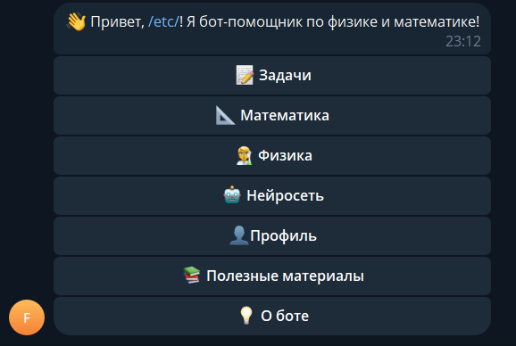
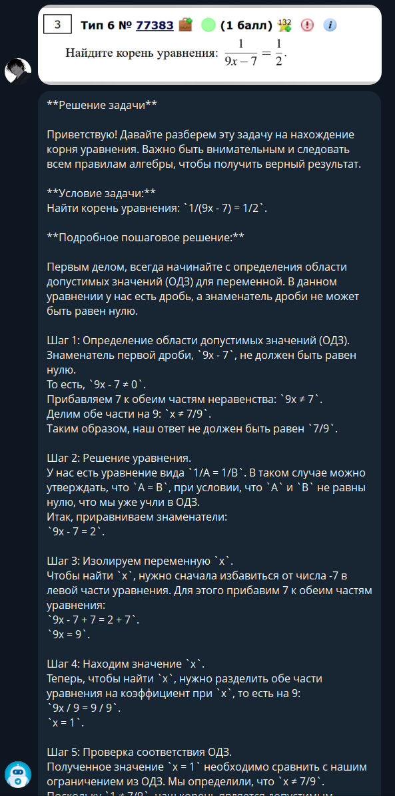
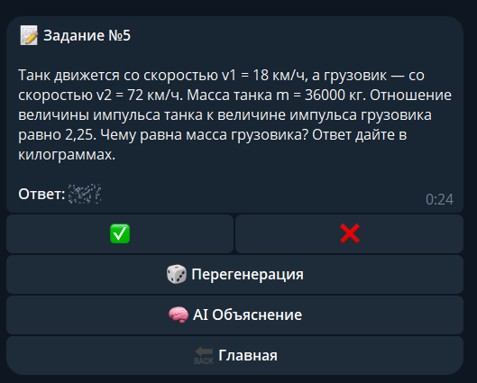
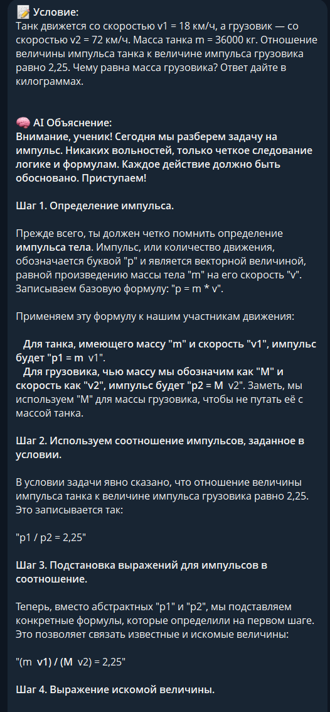
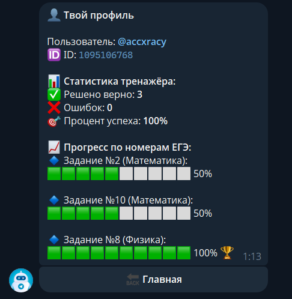
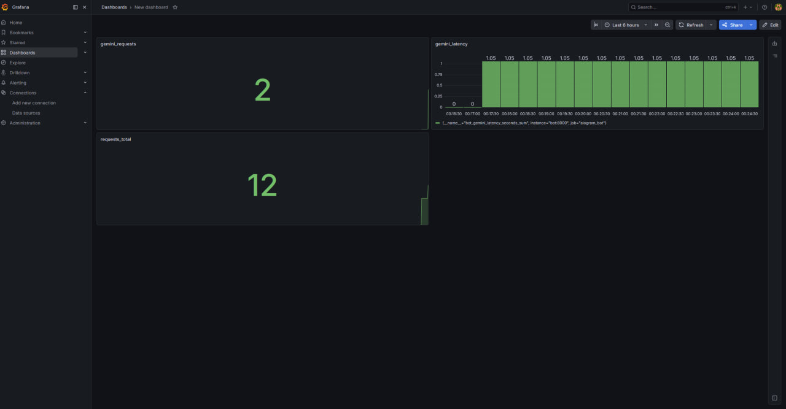

# Telegram-бот для подготовки по физике и математике

## Описание проекта
Проект представляет собой Telegram-бота, разработанного для помощи школьникам при подготовке по математике и физике. Бот объединяет в одном интерфейсе учебные материалы, тренировочные задачи, статистику пользователя и AI-помощник (на базе мультимодальной нейросети) для объяснения решений, ответов на вопросы и распознавания задач по фотографиям.

Основная идея проекта — сделать удобный инструмент для самостоятельной подготовки, где пользователь может не только читать теорию, но и сразу отрабатывать материал на практике, получая умный фидбек.

---

---

## Реализованный функционал

### 1. Главное меню
Пользователь взаимодействует с ботом через inline-кнопки. Главное меню содержит основные разделы:
- задачи;
- математика;
- физика;
- нейросеть;
- решение по фото;
- профиль;
- полезные материалы;
- информация о боте.

### 2. Разделы по предметам
Реализованы тематические разделы по двум предметам:

#### Физика
Для каждой темы доступны:
- теория;
- формулы;
- подсказки.

#### Математика
Для каждой темы доступны:
- формулы;
- теоремы.

### 3. Генерация задач
Бот умеет выдавать случайные задачи из базы данных по выбранному предмету.

Для каждой задачи пользователь может:
- посмотреть условие;
- открыть ответ;
- отметить, что задача решена верно;
- отметить ошибочное решение;
- запросить AI-объяснение.

### 4. Профиль пользователя
В профиле отображаются:
- Telegram-имя пользователя;
- ID пользователя;
- количество верно решённых задач;
- количество ошибок;
- процент успешности (Winrate).

### 5. AI-режим общения
Реализован режим общения с нейросетью на базе флагманской модели Gemini.

Возможности:
- ответы на вопросы по математике и физике;
- использование недавнего контекста диалога (память сессии);
- сохранение истории запросов и ответов;
- лимит на количество запросов в сутки (защита от спама).

Также AI используется для адаптивного объяснения решений задач из базы. Если нейросеть временно недоступна, бот переключается на fallback-механизм и показывает стандартное решение из БД.

### 6. Распознавание задач по фото (Multimodal Vision)
Реализована киллер-фича с использованием FSM (машины состояний) и мультимодальной нейросети Gemini 2.0 Flash:
- пользователь отправляет фотографию задачи (с доски, экрана или учебника);
- бот загружает изображение в оперативную память (без сохранения на диск) и передает напрямую в Vision API;
- ИИ анализирует картинку, считывает условие и выдает пошаговое математическое решение с аккуратным форматированием;
- встроена защита от ввода текста вместо фото и обработка ошибок парсинга Markdown.

### 7. История запросов
Пользователь может:
- посмотреть историю запросов к AI (`/history`);
- очистить историю (`/clear_history`).

### 8. Обратная связь
Через команду `/feedback` пользователь может отправить сообщение (фидбек, баг-репорт) напрямую администратору бота.

### 9. Полезные материалы
В отдельном разделе собраны внешние образовательные ресурсы:
- материалы ФИПИ;
- проверенные YouTube-каналы;
- полезные сайты и тренажёры.

### 10. Метрики и мониторинг
Проект поддерживает экспорт метрик для Prometheus и визуализацию в Grafana.

Собираются следующие показатели:
- количество запросов к боту с разделением по типам (`bot_requests_total`);
- количество успешных и неуспешных обращений к Gemini API (`bot_gemini_requests_total`);
- задержка ответов нейросети (`bot_gemini_latency_seconds` - Histogram-метрика).

Это позволяет анализировать стабильность работы AI-функционала и нагрузку на бота в реальном времени.

---
### 11. WebApp Тренажер
Для более комфортной практики реализован WebApp-интерфейс, запускаемый прямо внутри Telegram:
- **Интерактивность:** генерация задач и ввод ответа в привычном веб-формате без лишних команд.
- **Мгновенная проверка:** встроенный движок сравнения ответов с автоматическим сохранением статистики в базу данных.
- **AI-помощь:** возможность получить нейросетевое объяснение решения непосредственно в интерфейсе тренажера при ошибке.
- **Технологический стек:** FastAPI (Backend), HTML/JS/Telegram Web Apps API (Frontend).
---


## Используемые технологии
- **Python 3.12**
- **aiogram 3.x** (Асинхронный фреймворк, FSM, Routers)
- **PostgreSQL** (Основная БД)
- **Docker / Docker Compose** (Контейнеризация и оркестрация)
- **Prometheus & Grafana** (Сбор метрик и дашборды)
- **Google GenAI SDK (Gemini 2.0 Flash)** (LLM и Vision)
- **FastAPi** + **uvicorn**

---

## Структура проекта
```text
.
├── app/                  # Основная логика приложения
│   ├── data/             # Работа с БД, API и справочниками
│   ├── handlers/         # Роутеры (обработка команд и кнопок)
│   ├── config.py         # Конфигурация через переменные окружения
│   ├── keyboards.py      # Inline-клавиатуры
│   ├── metrics.py        # Экспорт метрик Prometheus
│   ├── seed.py           # Первичное наполнение БД задачами
│   ├── states.py         # Машина состояний (FSM)
│   └── utils.py          # Вспомогательные функции (рендер HTML, прогресс-бары)
├── infra/                # Инфраструктура и деплой
│   ├── 01_init.sql       # SQL-скрипт инициализации таблиц
│   └── prometheus.yml    # Конфиг для сбора метрик
├── webapp/
│  ├── Dockerfile   # докерфайл для fastapi
│  ├── main.py      # Роуты API для WebApp
│  └── index.html    # HTML-шаблон тренажера
│
├── main.py               # Точка входа (регистрация роутеров и запуск)
├── docker-compose.yml    # Конфигурация контейнеров (Bot, DB, Grafana, Prometheus)
├── Dockerfile            # Инструкция сборки образа бота
└── requirements.txt      # Зависимости
```
Назначение основных модулей
- `main.py` — точка входа. Содержит только инициализацию БД, подключение метрик и сборку роутеров `aiogram`. 
- `app/handlers/` — разделенная логика бота (Pattern Router):
- `ai_client.py` — взаимодействие с нейросетью (Gemini), обработка фото, контекстный диалог.
- `base.py` — базовые команды (`/start`, `/help`, `/history`, фидбек).
- `tasks.py` — генерация задач из базы и проверка ответов.
- `theory.py` — навигация по физике/математике и выдача материалов.
- `profile.py` — статистика пользователя и глобальный лидерборд.
- `app/data/` — слой работы с данными:
- `connection.py` — пул соединений PostgreSQL (asyncpg), CRUD-запросы.
- `neuro.py` — промпт-инжиниринг и API-клиент Gemini.
- `task_manage.py` — логика выдачи случайных задач.
- `infra/` — вынесенные системные файлы для корректного развертывания через Docker.

---

## Работа с базой данных
В базе данных хранятся:
- пользователи;
- история диалогов с AI;
- статистика каждого пользователя по решённым задачам;
- сами задачи, правильные ответы и официальные решения.

---

## Запуск проекта
Для запуска проекта необходимо:
1. Создать файл `.env` и указать переменные окружения;
2. Запустить контейнеры через Docker Compose.

Команда запуска:

```bash
docker compose up -d --build
```

После запуска становятся доступны:
- Telegram-бот;
- PostgreSQL;
- Prometheus;
- Grafana (порт 3000).

---

## Переменные окружения
Пример `.env` файла:

```env
BOT_TOKEN=your_telegram_bot_token
ADMIN_ID=your_telegram_id

DB_HOST=db
DB_PORT=5432
DB_NAME=bot_db
DB_USER=postgres
DB_PASSWORD=postgres

GEMINI_API_KEY=your_gemini_api_key
```

## Демонстрация работы

### Главное меню


### Распознавание задач по фото (Vision)


### Карточка задачи


### AI-объяснение задачи


### Профиль пользователя


### Мониторинг в Grafana


---
Инфраструктура и Production
Для работы в реальных условиях проект дополнен слоем обратного проксирования и автоматического шифрования:
Edge Server (Caddy): Автоматически получает и обновляет SSL-сертификаты от Let's Encrypt. Весь трафик к WebApp идет через защищенный HTTPS-туннель.
Reverse Proxy: Caddy перенаправляет внешние запросы с порта 443 на внутренний порт 5000 сервиса FastAPI, скрывая инфраструктуру от прямого доступа.
Изоляция: Порты базы данных (5432) и API (5000) закрыты снаружи и доступны только внутри Docker-сети.
🛠 Деплой на сервер (VPS)
Настройка домена: Направьте A-запись вашего домена на IP-адрес сервера.
Конфигурация Caddy: Создайте в корне проекта файл `Caddyfile`:
```text
  твой-домен.ru {
    reverse_proxy webapp:5000
  }
  ```
Обновление .env: Укажите публичный адрес в переменной `URL=https://твой-домен.ru`.
Запуск:
```bash
  docker compose up -d --build
  ```
### Безопасность
- Automated HTTPS: Шифрование трафика "из коробки" без ручной настройки сертификатов.
- Persistent Data: Использование Docker Volumes для сохранения данных БД и конфигураций прокси при перезагрузке.
- SSH-Hardening: Рекомендуется вход на сервер только по SSH-ключам (OpenSSH ed25519) с отключением парольной аутентификации.
---
Дополнительные технологии в стеке:
- Caddy (Web Server & HTTPS)
- FastAPI (WebApp Backend)
- Uvicorn (ASGI Server)
---


## Итог
В результате был разработан production-ready Telegram-бот, объединяющий учебные материалы, тренировочные задачи, мультимодальный AI-помощник и полноценную систему мониторинга. Проект не только решает прикладную задачу подготовки к экзаменам, но и демонстрирует использование современных инженерных практик: работу с асинхронностью, реляционными БД, контейнеризацией и наблюдаемостью сервиса (Observability).
